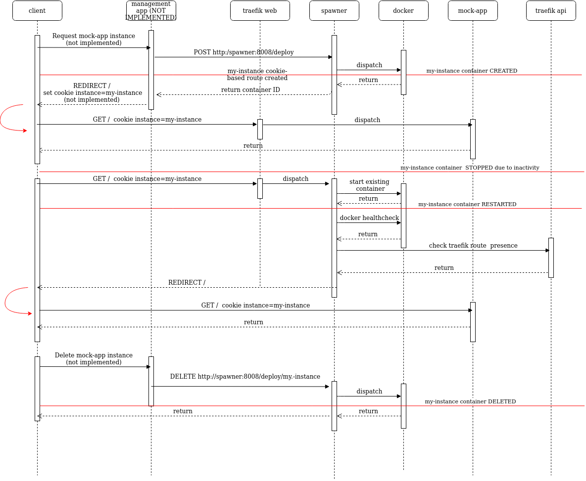

# ContainerDirectRouting

The spawner is a small wrapper around the docker APIs which is able to manage containers lifecycle.
When a container is created the HTTP routing is handled by traefik.
The spawner uses traefik rules to send requests to a specific instance, and it is also able to start stopped container and checks when they are ready to receive requests, redirecting the clients automatically, allowing a better usage of the available resources.

# Application description - cookie routing

spawner:
 - Port 8008 -> Create, list and destroy containers
 - Port 8000 -> Accept clients requests and starts stopped containers if the cookie match

 mock-app:
 - Port 9000 -> Mocks your app. Has an health-check url to verify availability before redirects clients

 mock-home:
 - Port 8000 -> Mocks the home of your site that provides user registrtion/authentication (not implemented) and fallback in case of errors

# Setup steps

- Your "Home app" must create the container using the spawner APIs on port 8008 (private API)
- The client should have a valid cookie indicating the desired container and call the root of your domain
  - If the container is UP and the cookie is valid traefik performs the Routing
  - If the container is DOWN and the cookie is valid the spawner starts the container and redirect the client to localhost/
  - If the client has no cookie or it is invalid, the client is redirected to the Home app at localhost/home 

- If you are not using the mock-app container but you want to spawn an image of your choice you need to download it with:
```
docker pull my-docker-image
```
- If you wanna try this in a browser a cookie is needed to reach a specific instance. With the browser dev-tools add a cookie for localhost with name _instance_ and value _minion-1_ in order to reach the container minion-1.

The spawner does NOT download the docker image for you atm.

## UML API calls scheme



## Try it

```bash

./build_project.sh

cd ./examples/cookie-routing

docker compose up

./create-minions-cookie.sh

./test-minions-cookie.sh
```
wait one minute for the mock-app containers to shutdown and test again

```bash
./test-minions-cookie.sh
```
Container should be started and a redirect sent to the client when the container is available.

As long as you call the mock-app container on / the self-shutdown is delayed 

When you are done testing cleanup the mock-app instances
```bash
./delete-minons.sh
```

### Supported health-check
- HTTP: the spawner search for a label in your instance container definition called health-check with the value of your app health-check url (see example)
- Docker: if your app Dockerfile has an HEALTHCHECK definition the spawner will inspect the container to retrive the status
If you defined both checks the spawner always prefers the Docker ones.

If no health-check mode is available the spawner will sleep for a little before redirects.

By default the spawner checks if traefik has installed a valid route (which also depends from docker HEALTHCHECK if you defined one) otherwise the spawner will stop the container.
You can disable this feature with the flag

```
-traefik-check-enabled=false
```

## Architecture Path Routing (obsolete)

This mode is deprecated. It works but is complex to configure and if the spawned application doesn't handle urls correctly your app routing may result broken.

See the configuration example under ./examples/path-routing

Enable this mode with

```
spawner -use-path-routing=true
```

This app spawn multiple instances of the mock-app container and make the direcly reachable trought the traefik proxy.
In order to do that the mock-app accept requests for a specific path with the container name in it (but can be something else), like this:

```
/$container-name
```

The traefik route will bind to the mock-app container with the rule PathPrefix(`/$container-name/`)
If the container does not exist it needs to be created by making a POST to the /deploy API (see the example)

```jsonl
  {
  "name":"minion-$1",
  "network":"traefiknet",
  "image":"mock-app:latest",
  "labels": {
    "healthcheck": "http:\/\/minion-$1:9000\/status",
    "traefik.enable": "true",
    "traefik.http.routers.minion-$1.entrypoints": "web",
    "traefik.http.routers.minion-$1.rule": "PathPrefix(\"/minion-$1\")",
    "traefik.http.routers.minion-$1.middlewares": "minion-$1-context",
    "traefik.http.middlewares.minion-$1-context.replacepathregex.regex": "^/minion-$1(.*)",
    "traefik.http.middlewares.minion-$1-context.replacepathregex.replacement": "\${1}"
    },
  "envs": {"CONNSTR":"db $1", "IDLE":"1m"}
  }
```
The container traefik configuration will strip the container name from the request PATH like this:

```
/minion-1/status
```
will be received from the spawned container as

```
/status
```

If you specify the label 

```
"healthcheck": "http:\/\/minion-$1:9000\/status",
```

The spawner app will use the value of the label to perform an health check when the app is resumed. This help us to redirect the user at the proper time.
The mock-app shutdown by itself after an IDLE time (default 1m). Can be ovveriden with the env var IDLE.
If the mock-app exists but is shutdown, making a request to /$container-name will bring it up again, because the spawner app will answer to the route /:container-name/.
This works because no specific route exist in traefik for the stopped container.
When the stopped container is up again a new (and specific) route is added automatically by traefik [see](https://doc.traefik.io/traefik/routing/routers/#rule), which allow direct routing.

```

---- request ---> traefik -- /deploy/ --> spawner ----> docker ---->  minion-1
                     |                                         ---->  minion-2
                     |                                         ---->  minion-3
                     |
                     +-------/minon-$i ----------->

```

## Try it

Build mock-app and spawner containers
clone the git repo

```
cd ContainerDirectRouting
./build_project.sh
```

run the docker compose file.

```
cd ./examples/path-routing
docker-compose up
```
This command creates the basic containers (traefik and spawner) in the specified attachable network.
If you don't demonize the docker-compose run you'll be able to see the predefined routes and the calls received from the apps.

## Create some mock-app instances

Move to the examples folder. You can use the curl request as a template to spawn your app with a valid configuration.

```
./create-minions.sh
```

Check the routes on traefik with the dashbord at localhost:8080

## Test your minions routing

```
./test-minions.sh
```

Wait for a minute until they shutdown.

(check with docker ps or the traefik dashbord)

Open your browser the go to:

```
http://localhost/minion-3
```

or launch again

```
./test-minions.sh
```

The request will hang for a little and then the spawner will redirects you to the correct container. All the other request will work normally.

The health-check internally checks the http://minion-x:9000/status API using the container networking and name resolution system, no ports of the mock-app need to be available outside the docker net.

The only constraint is that you should put the spawner and the mock-app on the same docker network.

If no health-check label is specified during the mock-app instance creation the redirect will wait for 2 seconds (by default), and the HTTP probe will be skipped.

The only endpoint reachable from outside the container network should be the ones mapped in traefik.

The spawner app /deploy API should be private. The /$container-name can be called from the outside to restore the container instance. The following request will be handled directly by the spawned container.

If you want to write your application that intercept the /$container-name requests just make PUT to /deploy/$container-ID to ask the spawner to restart the instace for you (no auto redirect or additional check are performed).

## Notes:

If you need or want to append some kind of path before the container name and make the spawner listen to a different URL for handling your container you can start the spawner as follow:

```bash
./spawner -container-prefix='/mycustomprefix'
```
The spawner will start container matching requests like
```bash
http://localhost/mycustomprefix/container-one
http://localhost/mycustomprefix/container-two
http://localhost/mycustomprefix/container-three
```
And modify the traefick container label like this
```
traefik.http.routers.spawner.rule: "PathPrefix(`/mycustomprefix`)"
```
You can also remove the regexreplace middlewares on the spawned container (see create example) if you want avoid rewritring the path.

## Clean up

```
./delete-minons.sh
cd ..
```

terminate the docker compose

```
docker-compose down
```

## Security notice 
This software is a PoC, APIs are not authenticated and should be managed carefully.
The /deploy/ route should be protected from external calls, in the provided docker-compose redirects on /.
Create your instances using the internal network like spawner:8008/deploy.
The /$container-name route is for public use.
This separation is done by traefik and is configured into the docker-compose.
Each spawner container is created with a custom label:
```
origin:spawner
```
This allow us to manage only the containers created by the spawner itself. 


